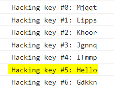

# Caeser Cipher

The Caeser Cipher, also know as the Shift Cipher is named after the roman emperor _Julius Caeser_ (Who used it in his private correspondence.).
It is one of the most simplest and widely known encryption technique, The encryption step performed by the "Caeser Cipher" Is used on more complex encryption. Like the Vingenere Cipher and etc...

## How it works

How the caeser cipher works is very simple. it shifts the letters an amount left or right. like for example. a left shift of 5, F would replace A, G would replace B and so on.

| Text-Type   | Alphabet                                                                     |
| ----------- | ---------------------------------------------------------------------------- |
| Plaint-Text | A, B, C, D, E, F, G, H, I, J, K, L, M, N, O, P, Q, R, S, T, U, V, W, X, Y, Z |
| Cipher-Text | F, G, H, I, J, K, L, M, N, O, P, Q, R, S, T, U, V, W, X, Y, Z, A, B, C, D, E |

So a message saying "Hello" would look like this, 
    Mjqqt

So, that's the basics of how it works.

> For extra info: Our Caeser Cipher Contains, Ascii-Uppercase-letters + Ascii-Lowercase-letters + Ascii+digits

## Keys and Help on deciphering

Since, We're nice people we're gonna give you the key we used it's
    left shift of 14.

But, you can just Brute-Force. It's totally up to you.
You can also view our [algorithms.py](https://github.com/lucky-leucrota/cj9-lucky-leucrota/blob/Main/src/routes/algorithms.py) file in our repository to get an idea as well.

Now let's write a simple implementation of a decryption script of a caeser cipher.

```python
import string

message = 'Mjqqt' #encrypted message we used above example
LETTERS = string.ascii_lowercase + string.ascii_uppercase + string.digits

for key in range(len(LETTERS)):
   translated = ''
   for symbol in message:
      if symbol in LETTERS:
         num = LETTERS.find(symbol)
         num = num - key
         if num < 0:
            num = num + len(LETTERS)
         translated = translated + LETTERS[num]
      else:                                                          
         translated = translated + symbol
   print('Hacking key #%s: %s' % (key, translated))
```

The above is a brute force caeser cipher decryption.
Output of the above should look like this.



As as you can see the highlighted part shows the unencrypted message.

And that's it you have learn everything regarding Caeser Cipher.
Thanks for reading!

~ Author- [Sas2k](https://github.com/Sas2k)