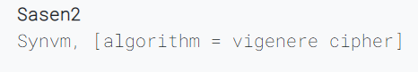

# Encryption algorithms

## Introduction

Here you will find details about the encryption algorithms, the keys and ways to decrypt them.

Some of the Encryption Algorithms used here are,

    - Caeser Cipher
    - Monoalphabetic Cipher

You can always findout which encryption method is used, because the encryption method is always displayed next to the message like below,

Here we know that the encryption used is the Vingenere cipher, so we can write some python code in the scripting area. To get the un-encrypted message. To learn more about that checkout the [Writing-Python-Code](../Writing-Python-Code), to have an overview.

## The algorithms

- [Caeser Cipher 🍕](/Algorithms/caeser-cipher)
- [Monoalphabetic Cipher 🅰](/Algorithms/monoalphabetic-cipher)
- [Transposition Cipher 🚇](/Algorithms/transposition-cipher)
- [Vingenere-Cipher 📼](/Algorithms/vingenere-cipher)

~ Author: [Sas2k](https://github.com/Sas2k)