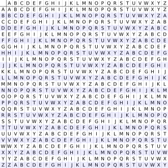
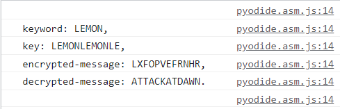

# Vingenere Cipher

The **Vigenère cipher** (French pronunciation: ​[viʒnɛːʁ]) is a method of encrypting alphabetic text by using a series of interwoven [Caesar ciphers](../caeser-cipher), based on the letters of a keyword. It employs a form of polyalphabetic substitution. So it's like a complicated brother to Caeser Cipher.

First introduced by Giovan Battista Bellaso in 1553, the cipher is easy to understand and implement.
But it resisted all attempts to break it until 1863.

In the 19th century, it was accidently attributed to Blaise de Vigenère. That's how it accquired it's present name.

(Source: Wikipedia + Me)

## How it works

So how it works basicly is like this,

The encryption of the normal text is done by a table called the Vingenere Square.

- It consists of 26 alphabets, but each of them is shifted 1 more then the last one.
- At different points of the encryption, it uses different alphabets.
- The alphabet that's used depends on a keyword



^ The vingenere cipher

```
Plain-Text: attackatdawn
keyword: LEMON
repeated-keyword: LEMONLEMONLE
Encrypted-Text: LXFOPVEFRNHR
```

So, that's how it works.

## Keys and Help on deciphering

The key, that we used to encrypt is

    luckyleucrota

yeah, it's literally our team name.

now let's write a small function to encrypt and decipher it. (This one is only here to give you an idea.)

You can also checkout our implementation of this in the [algorithms.py](https://github.com/lucky-leucrota/cj9-lucky-leucrota/blob/Main/src/routes/algorithms.py) to get an idea of it.

```python
def generateKey(string, key): # -> This function will make the keyword fit the message
    key = list(key)
    if len(string) == len(key):
        return(key)
    else:
        for i in range(len(string) -
                       len(key)):
            key.append(key[i % len(key)])
    return("" . join(key))
     
def Encrypt(string, key): # -> This is the function to Encrypt the message
    cipher_text = []
    for i in range(len(string)):
        x = (ord(string[i]) +
             ord(key[i])) % 26
        x += ord('A')
        cipher_text.append(chr(x))
    return("" . join(cipher_text))
     
def Decrypt(cipher_text, key): # -> This is the function to Decrypt the message
    orig_text = []
    for i in range(len(cipher_text)):
        x = (ord(cipher_text[i]) -
             ord(key[i]) + 26) % 26
        x += ord('A')
        orig_text.append(chr(x))
    return("" . join(orig_text))

string = "attackatdawn"
keyword = "LEMON"
key = generateKey(string.upper(), keyword)
cipher_text = Encrypt(string.upper(), key)
decrypted_text = Decrypt(cipher_text, key)

print(f"""
keyword: {keyword},
key: {key},
encrypted-message: {cipher_text},
decrypted-message: {decrypted_text}.
""")
```

(Source of (some) the Code: GeekforGeeks)

Now, if run this you would get this. output.



and that's basicly it for Vingenere Cipher. I'm pretty sure that there are more variations and decryptions out there.
So go and look for them. They're at your finger tips.

Thanks For Reading

~ [Sas2k](https://github.com/Sas2k)